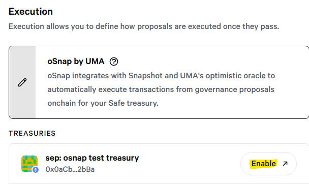

# Disabling oSnap

Requirements:&#x20;

* The below steps propose a Safe transaction to disable oSnap. Transactions can only be proposed to a Safe by that Safe's Signers or Proposers. You can view these roles on your Safe's settings page.
* Executing the proposed Safe transaction requires your minimum number of Signers to sign the transaction and one Signer to execute the transaction.

Steps:

1. Connect a Snapshot space admin wallet and navigate to your Snapshot space Settings page. If you do not have an admin wallet connected, you can also access this page by pasting in this URL with your DAO's ENS inserted: https://snapshot.box/#/\<YOUR DAO ENS>.eth/settings/execution
2. Click "Execution" on the left side menu and the pencil icon inside the "oSnap by UMA" box to show oSnap enabled Treasuries.
3. If your space has oSnap configured, Treasuries will display below the "oSnap by UMA" box with their status displayed as "Active".

<figure><figcaption></figcaption></figure>

5. To disable oSnap on a active oSnap treasury, hover over "Active", to show the "Disable" button and click it to open the oSnap Safe app.

<figure><figcaption></figcaption></figure>

6. Opening up the oSnap Safe app may bring up the following Safe warnings depending on your browser's stored cookies:

<figure><figcaption></figcaption></figure>

<figure><figcaption></figcaption></figure>

7. In the oSnap Safe app, click "Deactive oSnap"

<figure><figcaption></figcaption></figure>

8. This will propose a "disableModule" transaction in the Safe(Wallet) dapp. This transaction can be proposed, reviewed, signed, and executed as per the typical Safe(Wallet) transaction flow.

<figure><figcaption></figcaption></figure>

9. After this transaction is executed, oSnap is disabled from your Safe treasury. Treasuries without oSnap enabled will display with an "Enable" button in Snapshot's Execution settings page (note, it may take some time after the executed transaction for the Snapshot UI to update).

<figure><figcaption></figcaption></figure>
